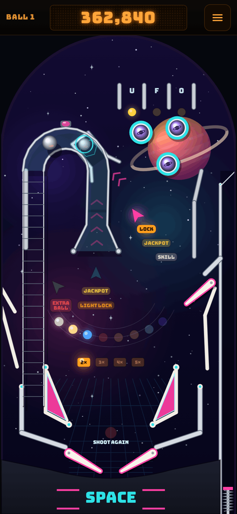
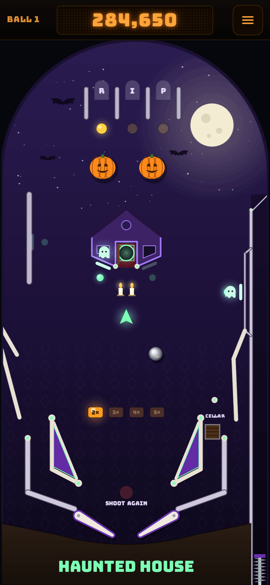
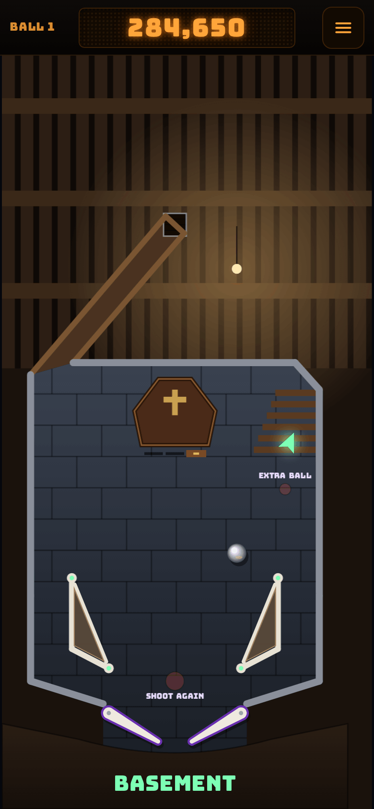

# Tilt

**Play it: [tilt.junkdrawer.works](https://tilt.junkdrawer.works/)**

**Three pinball tables you can play on your phone.** Classic is laid out and scored like an early-80s solid-state machine: three top lanes, three pop bumpers, a kickout, a spinner orbit, standup targets and a bank of drop targets. Space is an early-90s table: a ramp that carries the ball up and over the playfield, a lock under it for two-ball multiball, and a third flipper up the right side. Haunted House is the hard one: ghosts that only glow now and then, and a trapdoor that drops the ball into a basement with flippers of its own. Pick one on the title card. The ball runs on real-ish physics, measured in millimetres on a table the size of a real playfield: it rolls, skids when it's kicked, and plays at three-quarter speed so it's easy to follow on a phone (the flippers stay full speed).

<p align="center">
  
  &nbsp;
  
  &nbsp;
  
</p>
<p align="center">
  
  &nbsp;
  
</p>

## How it plays

- **Flip** by tapping and holding the left or right half of the screen. On a keyboard: Z and / (or the Shift keys, or ← →).
- **Launch** by holding the Launch button and letting go: the longer you hold, the harder the shot. Keyboard: hold Space or ↓.
- **Nudge** with a quick swipe up, or ↑. Nudge too often and you get a Danger warning, then the machine tilts: the flippers go dead and you lose the bonus.
- **The bonus** is counted, times the multiplier, when the ball drains. A ball that drains in the first few seconds is given back.
- No account and no server. Each table keeps its own top five scores in your browser. It works offline and installs to a phone's home screen.

### Classic

- **Skill shot.** The flashing top lane is worth 25,000 if the plunge drops into it. The flippers move it left and right.
- **Top lanes** A, B and C raise the bonus multiplier (up to 5×) and light the bumpers at 1,000 a pop.
- **Standups** on the orbit rail light the spinner at 1,000 a spin.
- **Drop targets** light an extra ball at the kickout in the middle; after that, a full bank is worth 25,000.
- **The bonus** counts up as you hit things.

### Space

- **The ramp** is a shot for the left flipper. It climbs over the playfield, turns round a hairpin and comes back down a wire to the left flipper, for 10,000. It lights the lock and raises the jackpot.
- **The upper flipper** works with the right one. Shoot the orbit with the right flipper and keep holding the button: the ball comes round onto the upper flipper. From there, shoot the dock under the ramp: with the lock lit the ball is locked there and another is served. Light the lock again and shoot the dock for two-ball **multiball**.
- **In multiball** the ramp scores the jackpot and the dock lights it again. The jackpot starts at 100,000 and each ramp made outside multiball adds 10,000, up to 250,000. Multiball starts with ten seconds of ball save.
- **Skill shot.** Launch softly onto the upper flipper and shoot the dock for 25,000.
- **Top lanes** U, F and O raise the bonus multiplier (up to 5×). The flippers move the lit lanes.
- **Planets.** Each ramp lights one. All eight light an extra ball at the left orbit, once a game; after that they're worth 50,000.
- **The bonus** is 2,000 for each ramp and 1,000 for each orbit made with that ball.

### Haunted House

- **The hard one.** Wider outlanes and shorter flippers than Classic, two pop bumpers, and five seconds of ball save (though it never runs out before the ball has first come down to the flippers).
- **Ghosts** glow now and then: one in each window of the house, one on the left orbit's rail and one on the right wall. Each glows for three seconds at a time, never more than two at once. Hit one while it glows to catch it: 5,000 for the first on a ball, 10,000 for the next, up to 25,000.
- **The front door** opens once two ghosts are caught (three the next time, then four). While it's shut, a hard shot knocks on it for 1,000 and wakes a ghost.
- **The trapdoor** is behind the door. Shoot through the open door and the ball drops into the **basement**, a little table of its own under the house, with its own flippers and no outlanes. 10,000.
- **The coffin** in the basement has a lid of three drop targets. Knock all three off to light an extra ball, once a game; after that, a coffin is worth 50,000.
- **The stairs** in the basement's top corner take the ball back up for 10,000 (and the lit extra ball), out of the cellar door in the right inlane.
- **Skill shot.** The flashing top lane is worth 25,000 if the plunge drops into it. **Top lanes** R, I and P raise the bonus multiplier (up to 5×); the flippers move the lit lanes.
- **The bonus** is 2,000 for each ghost caught and 10,000 for each trip to the basement with that ball.

## Running it

It's a static site: plain HTML, CSS and JavaScript, with no build step.

```sh
npx serve .                   # or any static file server, then open the printed address
npm test                      # the physics and rules in Node, then plays it in Chromium (needs Playwright)
npm run build                 # dist/tilt.html: the whole game in one file
node tools/screenshots.mjs    # redraws docs/*.png and og.png
node tools/make-icons.mjs     # redraws the PNG icons from icon.svg
```

Add `?debug` to the address to see the outlines the ball actually bounces off.

To put it online with GitHub Pages: **Settings → Pages → Build and deployment → Deploy from a branch**, then pick `main` and `/ (root)`.

### Files

- `js/physics.js`: the ball (and its spin), walls, bumpers, flippers and ramps, in fixed thousandth-of-a-second steps. A ramp is a level of its own above the playfield: a ball up there only meets the ramp's walls. A basement is a level too, under the playfield.
- `js/game.js`: the machine every table shares: serving balls, the flippers, ball save, tilt, extra balls, locks and multiball, the end of a ball and of the game, and the demo's autopilot.
- `js/tables.js`: the list of tables. Each table is a folder in `js/tables/` with its own layout, rules, drawing and skins.
- `js/tables/classic/`: the Classic table: `layout.js` (where everything is, in millimetres), `rules.js` (what everything scores, its lamps and bonus), `draw.js` (its playfield, lamps and toys) and `skins.js` (colours, names and artwork). `index.js` puts them together, with its rules for How to play.
- `js/tables/space/`: the Space table, in the same five files. Its ramp, the dock and the lift that puts a ball back on the ramp are in `layout.js` and `rules.js`.
- `js/tables/haunted/`: the Haunted House table, in the same five files. The house and the basement are two levels of one layout; `rules.js` moves the ball between them and says which one the screen shows.
- `js/settings.js`: the machine's adjustments (slope, game speed, flipper strength, ball save, tilt warnings), which difficulty levels will build on.
- `js/render.js`: fits a table to the canvas and draws what every table has (rails, posts, flippers, the ball, the plunger), and slides the screen between a table's floors; `js/sound.js`: every sound, made in the browser with Web Audio.
- `js/main.js`: the page: controls, menus, the table picker, high scores (each table keeps its own) and the clock.
- `fonts/`: Bungee and Figtree (SIL Open Font License), served from here so nothing loads from elsewhere.
- `sw.js`: keeps a copy for playing offline.
