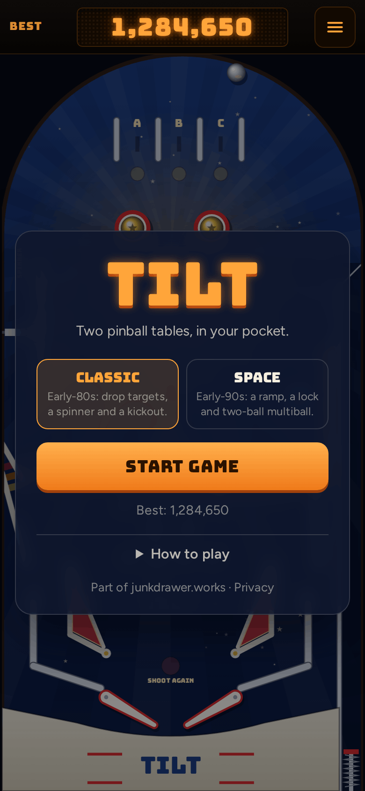
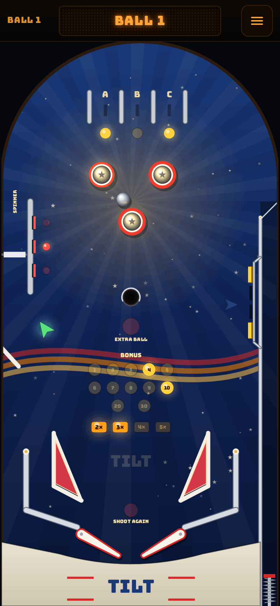

# Tilt

**Play it: [tilt.junkdrawer.works](https://tilt.junkdrawer.works/)**

**A classic pinball table you can play on your phone.** It's laid out and scored like an early-80s solid-state machine: three top lanes, three pop bumpers, a kickout, a spinner orbit, standup targets and a bank of drop targets. The ball runs on real-ish physics, measured in millimetres on a table the size of a real playfield: it rolls, skids when it's kicked, and plays at three-quarter speed so it's easy to follow on a phone (the flippers stay full speed).

<p align="center">
  
  &nbsp;
  
</p>

## How it plays

- **Flip** by tapping and holding the left or right half of the screen. On a keyboard: Z and / (or the Shift keys, or ← →).
- **Launch** by holding the Launch button and letting go: the longer you hold, the harder the shot. Keyboard: hold Space or ↓.
- **Nudge** with a quick swipe up, or ↑. Nudge too often and you get a Danger warning, then the machine tilts: the flippers go dead and you lose the bonus.
- **Skill shot.** The flashing top lane is worth 25,000 if the plunge drops into it. The flippers move it left and right.
- **Top lanes** A, B and C raise the bonus multiplier (up to 5×) and light the bumpers at 1,000 a pop.
- **Standups** on the orbit rail light the spinner at 1,000 a spin.
- **Drop targets** light an extra ball at the kickout in the middle; after that, a full bank is worth 25,000.
- **The bonus** counts up as you hit things and is counted down, times the multiplier, when the ball drains. A ball that drains in the first few seconds is given back.
- No account and no server. Your top five scores stay in your browser. It works offline and installs to a phone's home screen.

## Running it

It's a static site: plain HTML, CSS and JavaScript, with no build step.

```sh
npx serve .                   # or any static file server, then open the printed address
npm test                      # the physics and rules in Node, then plays it in Chromium (needs Playwright)
npm run build                 # dist/tilt.html: the whole game in one file
node tools/screenshots.mjs    # redraws docs/*.png and og.png
node tools/make-icons.mjs     # redraws the PNG icons from icon.svg
```

Add `?debug` to the address to see the outlines the ball actually bounces off.

To put it online with GitHub Pages: **Settings → Pages → Build and deployment → Deploy from a branch**, then pick `main` and `/ (root)`.

### Files

- `js/physics.js`: the ball (and its spin), walls, bumpers, flippers and ramps, in fixed thousandth-of-a-second steps. A ramp is a level of its own above the playfield: a ball up there only meets the ramp's walls.
- `js/game.js`: the machine every table shares: serving balls, the flippers, ball save, tilt, extra balls, the end of a ball and of the game, and the demo's autopilot.
- `js/tables.js`: the list of tables. Each table is a folder in `js/tables/` with its own layout, rules, drawing and skins.
- `js/tables/classic/`: the Classic table: `layout.js` (where everything is, in millimetres), `rules.js` (what everything scores, its lamps and bonus), `draw.js` (its playfield, lamps and toys) and `skins.js` (colours, names and artwork). `index.js` puts them together, with its rules for How to play.
- `js/settings.js`: the machine's adjustments (slope, game speed, flipper strength, ball save, tilt warnings), which difficulty levels will build on.
- `js/render.js`: fits a table to the canvas and draws what every table has (rails, posts, flippers, the ball, the plunger); `js/sound.js`: every sound, made in the browser with Web Audio.
- `js/main.js`: the page: controls, menus, high scores and the clock.
- `fonts/`: Bungee and Figtree (SIL Open Font License), served from here so nothing loads from elsewhere.
- `sw.js`: keeps a copy for playing offline.
